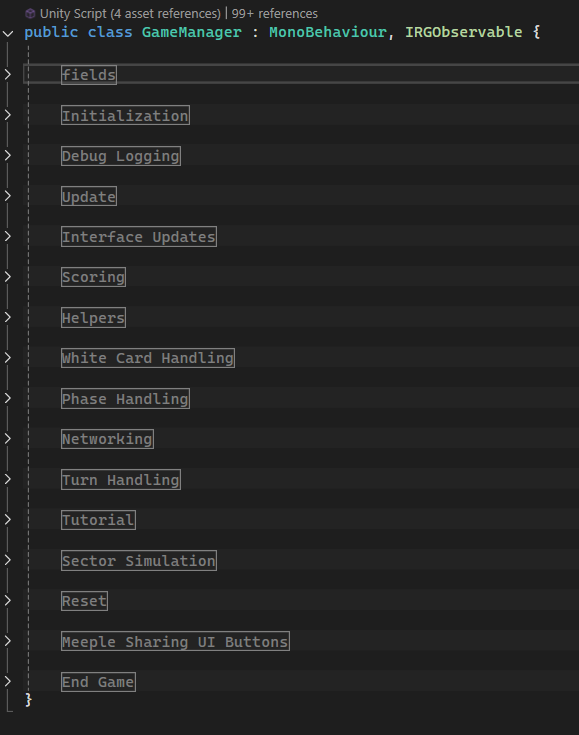

# Important Files

## File Structure

Scripts are located in **/Scripts,** **/Networks**, and **/Cards** in the project directory.

Art is split between the /UIArt and /StreamingAssets

## Game Singletons

- **GameManager.cs**
    - handles all of the central game state logic contains code to do many of the following:
        - initialize the players, sectors, facilities
        - serves as a central controller to pass network messages through
        - Handles progressing the game through the game phases and turns
        - The game manager is split into several sections
        
        
        

- **RGNetworkManager.cs**
    - This is the central network manager singleton, it does all of the following:
        - Handles connecting new network players and tracking them in various class lists
        - Handles relaying network message
            - see `UpdateObserver()`
        - Handles sending and receiving message for the server and the client
- **UserInterface.cs**
    - Handles user interface updates, these are updates to the player HUD (deck count, meeple count, button states, menus showing up ect…)
- **ScoreManager.cs**
    - Controls all of the scoring logic in the game.
    - The score manager’s functions are called from all over to add points to the players
- **HistoryMenuController.cs**
    - Controls the visuals of the history menu for recent card plays
- **Tooltip.cs**
    - Controls game’s tooltips

## Core files

- **CardPlayer.cs**
    - Each player gets a CardPlayer instance, the LOCAL player will have this card player instance assigned to the `actualPlayer` in the GameManager.
    - Other players act as replication of the other players
        - So if player ID 1 plays a card on one client, the player with ID 1 on all of the other clients will be told to play that card as well
    - This is the largest single file in the project. It handles all actions that the player might need to do:
        - Initialization
        - Specific card actions
            - Things that force the player to do something ie. discard a card
        - Meeple spending and tracking
        - Card Drawing
        - Card playing
        - Card validation
        - Discarding
        - Network updates
            - Network Updates begin in this class. See more in the Detailed Networking Docs
- Sector.cs
    - Controls storing information and updating the info and display of the game’s sectors
    - Most card plays get passed to the sectors in order to create the animations
- Facility
    - 3 of these make up a sector
- FacilityEffect, FacilityEffectUIElement, FacilityEffectManager
    - have to do with facility effects from cards
- Card, CardFront, CardData
    - hold info about the cards

### Many other smaller files, too many to list, mostly pertaining to different UI elements.